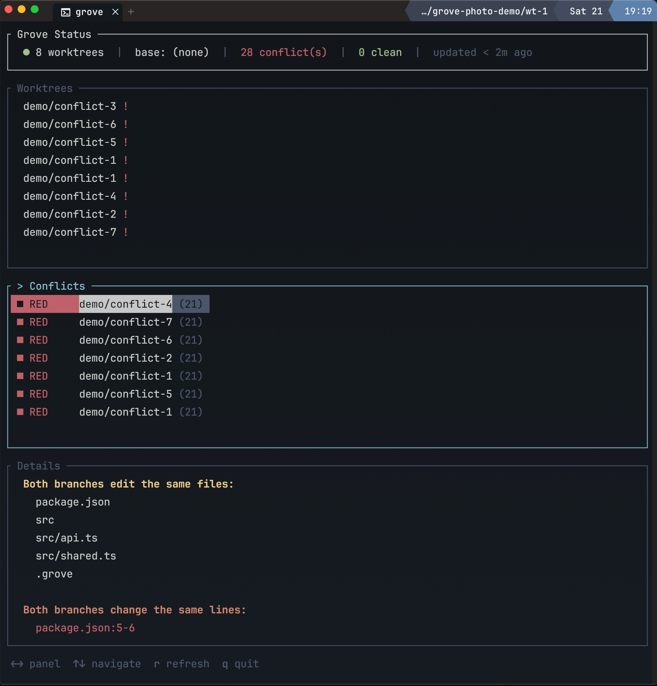

# Grove

Cross-worktree conflict intelligence for git. Detects file, hunk, symbol, dependency, and schema overlaps between parallel workstreams before merge time.

Grove watches your git worktrees, continuously analyzes pairwise overlaps, and tells you which branches will conflict before you attempt to merge. Perfect for your multi-agents working in parallel worktrees ;)



## Why

When multiple people (or agents) work in parallel branches, merge conflicts are discovered too late — at merge time. Grove shifts conflict detection left by analyzing worktree diffs against a shared base and scoring how likely they are to collide. You can setup your agents to check this automatically.

Five overlap layers, from coarse to precise:

| Layer | What it catches | Score |
|-------|----------------|-------|
| **File** | Both branches modified the same file | Yellow |
| **Hunk** | Edits land in overlapping line ranges | Red (adjacent = Yellow) |
| **Symbol** | Same function/type/export modified in both | Red |
| **Dependency** | One branch changes an export that the other imports | Black |
| **Schema** | Both touch migrations, package deps, env config, or routes | Yellow |

The worst overlap determines the pair's **orthogonality score**: Green (safe) < Yellow (review) < Red (likely conflict) < Black (breaking change).

## Install

```sh
brew install NathanDrake2406/tap/grove
```

Or from source:

```sh
cargo install --path crates/grove
```

## Quick start

```sh
grove status                                    # that's it — daemon auto-starts
grove conflicts feat/auth feat/payments         # compare two branches
grove conflicts feat/auth feat/payments --json  # machine-readable
```

## Shell integration

Grove provides a `gr` shell wrapper that adds `gr switch` for quick worktree navigation:

```sh
# Add to your shell profile
eval "$(grove init zsh)"    # or bash, fish

# Switch to a worktree (cd's into it)
gr switch feat/auth

# Everything else passes through to grove
gr status
gr conflicts feat/auth feat/payments
```

## Commands

| Command | Description |
|---------|-------------|
| `grove` | Open the live TUI dashboard (interactive terminal) |
| `grove status` | Workspace list + conflict summary |
| `grove list` | Table of all tracked worktrees |
| `grove conflicts <a> <b>` | Pairwise conflict detail between two branches |
| `grove dashboard` | Explicit TUI dashboard |
| `grove daemon start` | Start the background daemon |
| `grove daemon stop` | Stop the daemon |
| `grove daemon status` | Daemon health check |
| `grove check` | Exit 0 if clean, exit 1 with conflict one-liners on stderr |
| `grove init <shell>` | Emit shell integration (`zsh`, `bash`, `fish`) |

All read commands accept `--json` for machine-readable output.

## Claude Code hook

Grove integrates with [Claude Code](https://docs.anthropic.com/en/docs/claude-code) via a post-tool hook that runs `grove check` after every file edit. When a conflict is detected, Claude sees the warning in its tool output and can course-correct before the problem compounds.

Add this to your project's `.claude/settings.json`:

```json
{
  "hooks": {
    "PostToolUse": [
      {
        "matcher": "Edit|Write|MultiEdit",
        "hooks": [
          {
            "type": "command",
            "command": "grove check 2>&1 || true"
          }
        ]
      }
    ]
  }
}
```

After any file edit, Claude will see output like:

```
[Red] feat/payments: processPayment() in src/shared.ts (+2 more)
[Yellow] feat/auth: 3 shared file(s)
```

Or silence when clean (exit 0, no output).

### How it works

1. Claude edits a file via `Edit`, `Write`, or `MultiEdit`
2. The hook runs `grove check` in the current worktree
3. If conflicts exist, `grove check` prints one-liners to stderr and exits 1
4. The `|| true` ensures the hook never blocks Claude — conflicts are advisory
5. Claude sees the conflict warnings and can adjust its approach

### JSON mode for structured parsing

For agents that prefer structured output, use `grove check --json`:

```json
{
  "hooks": {
    "PostToolUse": [
      {
        "matcher": "Edit|Write|MultiEdit",
        "hooks": [
          {
            "type": "command",
            "command": "grove check --json 2>&1 || true"
          }
        ]
      }
    ]
  }
}
```

This returns a JSON object with `workspace`, `clean`, and `conflicts` fields.

## Architecture

Single binary, 4-crate Rust workspace:

```
grove (binary)
  grove-cli ── CLI commands, socket client, terminal rendering
  grove-daemon ── Background daemon, SQLite persistence, file watcher, worker pool
grove-lib ── Pure analysis library (no I/O)
```

The daemon runs an actor model — a single `DaemonState` thread processes all mutations sequentially via `tokio::mpsc` channels. Workers, watchers, and socket connections communicate through channels. No shared mutable state.

`grove-lib` is a deterministic core: given the same inputs, it produces the same outputs. It depends on a `FileSystem` trait, never touches disk directly.

### Language support

Symbol extraction, import/export resolution, and schema detection for:

- TypeScript / JavaScript
- Rust
- Go
- Python
- Java
- C#

### Socket protocol

The daemon exposes an NDJSON protocol over a Unix socket at `.grove/daemon.sock`. Each request is one JSON line, each response is one JSON line.

```
Request:  {"method": "status", "params": {}}
Response: {"ok": true, "data": {"workspace_count": 3, "analysis_count": 2, ...}}
```

Available methods: `status`, `list_workspaces`, `get_workspace`, `conflicts`, `get_all_analyses`, `await_analysis`, `sync_worktrees`, `subscribe`, `shutdown`.

#### Event subscription

Agents and tools can subscribe to real-time events instead of polling:

```
>> {"method": "subscribe", "params": {}}
<< {"ok": true, "data": {"subscribed": true}}
<< {"event": "analysis_started", "data": {"workspace_a": "...", "workspace_b": "..."}}
<< {"event": "analysis_complete", "data": {"workspace_a": "...", "workspace_b": "...", "score": "Yellow"}}
```

Events: `analysis_started`, `analysis_complete`, `workspace_added`, `workspace_removed`, `base_ref_changed`.

#### Await analysis

Block until all in-flight analyses finish (or timeout), instead of polling:

```
>> {"method": "await_analysis", "params": {"timeout_ms": 5000}}
<< {"ok": true, "data": {"in_flight": 0, "analysis_count": 3}}
```

`in_flight == 0` means all analyses are complete.

## Development

```sh
cargo build                     # Build all crates
cargo test                      # Run all tests
cargo clippy --workspace        # Lint
cargo fmt --check               # Format check
cargo test -p grove-lib         # Test core library only
cargo test -p grove-daemon      # Test daemon
```

## License

MIT OR Apache-2.0
