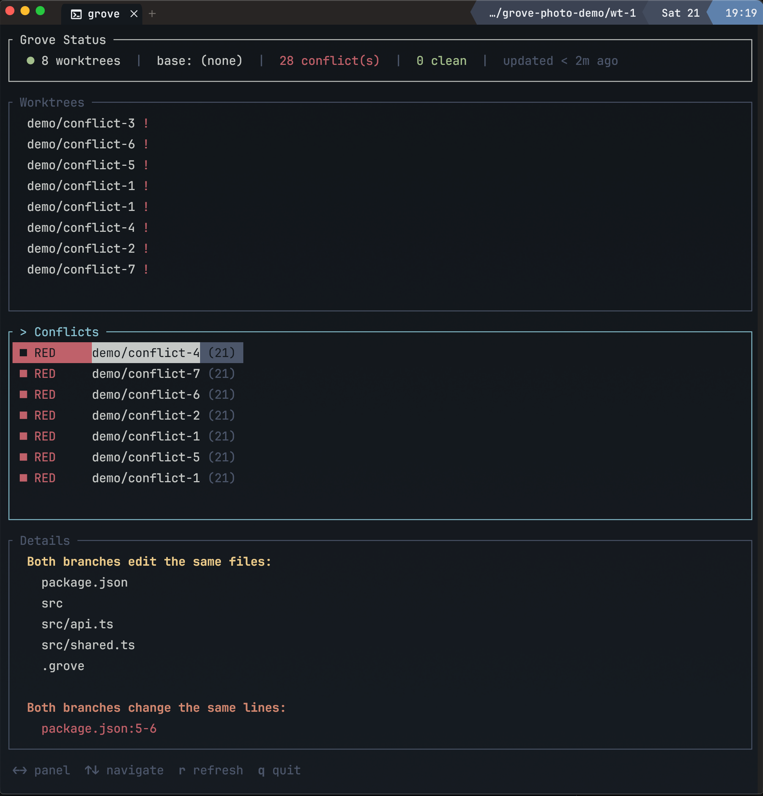

# Grove

See conflicts between git worktrees before merge time.

Grove watches the worktrees in a repository and compares their changes against `main`. It catches overlap at five levels: files, hunks, symbols, dependencies, and shared schema or configuration files. Read the result in the terminal, consume it as JSON, run it after an agent edits a file, or check open pull requests in GitHub Actions.



## Install

Prebuilt binaries are available for macOS and Linux on x86_64 and ARM64.

With Homebrew:

```sh
brew install NathanDrake2406/tap/grove
```

With npm:

```sh
npm install -g @nathan2406/grove
```

You can also run a one-off check without installing the package globally:

```sh
npx @nathan2406/grove check
```

From source:

```sh
git clone https://github.com/NathanDrake2406/grove.git
cd grove
cargo install --path crates/grove
```

## Start in a repository

Run Grove from any worktree:

```sh
grove status
```

There is no repository initialization step. On first use, Grove:

1. Creates `.grove/` at the repository root.
2. Adds `.grove/` to `.git/info/exclude`.
3. Discovers the main and linked worktrees.
4. Starts the local daemon if it is not running.
5. Begins pairwise analysis against `main`.

Open the live dashboard:

```sh
grove
```

Compare two worktrees by name or short branch name:

```sh
grove conflicts feat/auth feat/payments
grove conflicts feat/auth feat/payments --json
```

Check only the current worktree:

```sh
grove check
```

`grove check` prints nothing and exits `0` when the worktree is clean. Any Yellow, Red, or Black result produces a short warning on stderr and exits `1`.

## What Grove detects

| Layer | Detection | Score |
|:------|:----------|:------|
| File | Both worktrees changed the same path | Yellow |
| Hunk | Changed line ranges overlap, or fall within five lines | Red for overlap; Yellow for proximity |
| Symbol | Both worktrees changed the same named symbol in overlapping ranges within one file | Red |
| Dependency | An export change in one worktree affects a file imported by the other | Black |
| Schema | Both worktrees changed files in the same migration, package, environment, CI, or route category | Yellow |

The most severe overlap becomes the pair's orthogonality score:

| Score | Meaning |
|:------|:--------|
| Green | No overlap detected |
| Yellow | The pair shares a file, nearby lines, or a schema category |
| Red | The pair changes overlapping lines or the same symbol |
| Black | A changed export is imported by the other worktree |

Symbol and dependency analysis supports TypeScript/JavaScript, Rust, Go, Python, Java, and C#.

## Commands

| Command | Description |
|:--------|:------------|
| `grove` | Open the TUI when attached to a terminal; otherwise print status |
| `grove status` | Show worktrees and their conflict summary |
| `grove list` | List tracked worktrees |
| `grove conflicts <a> <b>` | Show overlap details and a merge-order hint for one pair |
| `grove check` | Check the current worktree; exit `1` for any non-Green result |
| `grove dashboard` | Open the TUI explicitly |
| `grove daemon start` | Run the daemon process manually |
| `grove daemon stop` | Ask the daemon to shut down |
| `grove daemon status` | Query the daemon and print repository status |
| `grove ci analyze [refs...]` | Analyze refs without the local daemon and write JSON |

`grove status`, `grove list`, `grove conflicts`, and `grove check` accept `--json`.

For stateless branch analysis:

```sh
grove ci analyze --base main origin/feat/auth origin/feat/payments
```

Use `--refs-from-stdin` when another tool supplies the refs, and repeat `--disable-layer` to skip `file`, `hunk`, `symbol`, `dependency`, or `schema` analysis.

## Agent checks

`grove check` is designed for tools that need a local warning after an edit.

| Label | Score | Meaning |
|:------|:------|:--------|
| `[minor]` | Yellow | File, nearby-hunk, or schema overlap |
| `[conflict]` | Red | Overlapping lines or the same symbol changed |
| `[breaking]` | Black | An export change affects an import in another worktree |

### Claude Code hook

Add this to `.claude/settings.json`:

```json
{
  "hooks": {
    "PostToolUse": [
      {
        "matcher": "Edit|Write",
        "hooks": [
          {
            "type": "command",
            "command": "grove check"
          }
        ]
      }
    ]
  }
}
```

For a `PostToolUse` hook, Claude Code treats exit `1` as a non-blocking error and shows the stderr warning. The edit has already completed. See the [Claude Code hooks reference](https://code.claude.com/docs/en/hooks).

A conflict looks like this:

```text
[conflict] feat/payments: both branches modify processPayment() in src/shared.ts (+2 more)
[minor] feat/auth: 3 file(s) modified by both branches

Run `grove conflicts <this-branch> <other-branch>` for full details.
```

For another tool to parse the result, use:

```sh
grove check --json
```

The JSON object contains `workspace`, `clean`, and `conflicts`.

## GitHub Action

The GitHub Action compares open pull requests that target the same base branch. On a `pull_request` run it posts or updates one Grove comment on the triggering PR, including overlap details and merge-order guidance.

```yaml
# .github/workflows/grove.yml
name: Grove Conflict Check

on:
  pull_request:
    branches: [main]

permissions:
  contents: read
  pull-requests: write

jobs:
  conflicts:
    runs-on: ubuntu-latest
    steps:
      - uses: actions/checkout@v4
        with:
          fetch-depth: 0

      - uses: NathanDrake2406/grove/action@v0.4.1
```

The action lives in the repository's `action` directory, so the `/action` segment in `uses` is required.

### Scheduled conflict matrix

On `schedule` or `workflow_dispatch`, the same action creates or updates a single issue containing the conflict matrix for the base branch.

```yaml
name: Grove Conflict Matrix

on:
  schedule:
    - cron: "0 */6 * * *"
  workflow_dispatch:

permissions:
  contents: read
  pull-requests: read
  issues: write

jobs:
  matrix:
    runs-on: ubuntu-latest
    steps:
      - uses: actions/checkout@v4
        with:
          fetch-depth: 0

      - uses: NathanDrake2406/grove/action@v0.4.1
```

### Action inputs

| Input | Default | Description |
|:------|:--------|:------------|
| `github-token` | `${{ github.token }}` | Token used for GitHub API calls |
| `base-branch` | `main` | Base branch used for PR discovery and analysis |
| `grove-version` | `latest` | Grove release to install, such as `v0.4.1` |
| `max-branches` | `50` | Maximum open PR branches, newest first |
| `timeout` | `30` | Analysis timeout per pair, in seconds |
| `disable-layers` | Empty | Comma-separated layers to skip |
| `comment-on-clean` | `false` | Keep a PR comment when no conflicts remain |

## Architecture

Grove is a five-crate Rust workspace distributed as one binary:

```text
grove
├── grove-cli      CLI commands and daemon client
├── grove-daemon   State actor, watcher, workers, socket, and SQLite storage
├── grove-tui      Interactive terminal dashboard
└── grove-lib      Diff, parser, graph, schema, scoring, and merge-order analysis
```

One `DaemonState` task owns mutable state and processes messages sequentially. File watchers, socket connections, and analysis workers communicate with it through channels. Pair analysis runs in a worker pool sized from the available CPUs and clamped to one through eight workers.

The daemon stores its PID, Unix socket, shutdown token, and SQLite database under `.grove/`. SQLite uses WAL mode. The socket speaks newline-delimited JSON and limits each line to 1 MiB.

Key local defaults:

| Setting | Default |
|:--------|:--------|
| Base branch | `main` |
| Analysis timeout | 30 seconds per pair |
| Maximum worktrees | 20 |
| File watcher debounce | 500 ms |
| Parser file-size limit | 1 MiB |
| Socket idle timeout | 5 minutes |

## Development

```sh
cargo build --workspace
cargo test --workspace
cargo clippy --workspace -- -D warnings
cargo fmt --check
```

Rebuild the bundled GitHub Action with:

```sh
cd action
npm ci
npm run build
```

## License

MIT OR Apache-2.0
